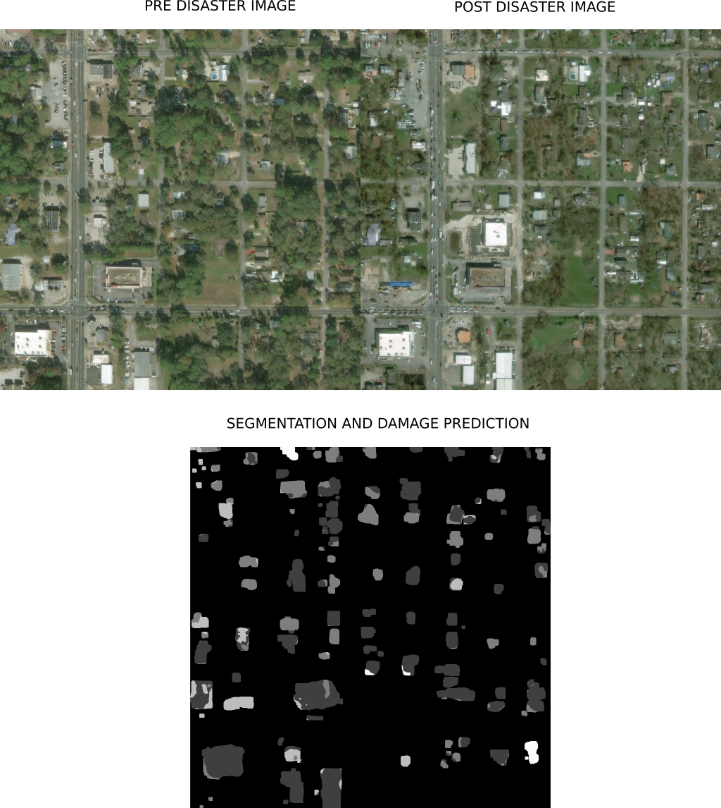
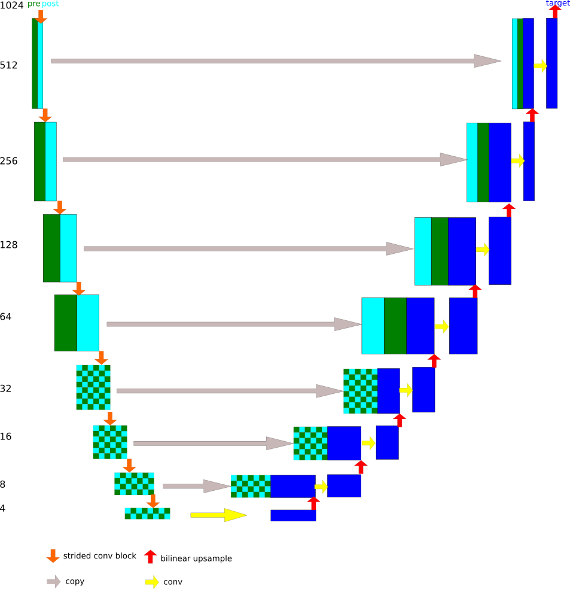

### AI FOR HUMANITARIAN ASSISTANCE AND DISASTER RELIEF 
### INSTANCE SEGMENTATION AND CLASSIFICATION OF BUILDING DAMAGE USING PAIR OF PRE AND POST DISASTER IMAGES



### OPENSOURCE XVIEW2 SUBMISSION USING MODIFIED UNET (MORE STAGES AND PAIRED IMAGE INPUTS) 

 

### TESTED ON UBUNTU 18.04, PYTHON 3.7.5, USING RTX GPU WITH HIGH VRAM

### Get XView2 Data

Untar train.tar and tier3.tar and test.tar from https://xview2.org/dataset

Arrange data as follows:

```bash
data
├── test
│   └── images
└── train
    ├── images1024
    ├── labels1024
    └── targets1024
```

### INSTRUCTIONS 

For fp16 training using Volta or Turing GPU install Nvidia apex python only version from https://github.com/NVIDIA/apex . (Note the automatically applied dynamic loss scaling feature may help with stability of training) 

You may need to modify batch sizes in ```trainlocunet.py``` and ```traindamgeunet.py```

```bash
pip install -r requirements.txt 
python preprocess.py
python trainlocunet.py
python traindamageunet.py
tree workspace # to see your checkpoints and tensorboard logs 
python testdamage.py
```

Results will be in 
```bash
results
├── predictions          # pixel values in range (0-1) or (0-4) valid for submission (zip this folder for submission) 
└── vizpredictions       # pixel values in range (0-255) for easy viewing
```

### Score
Just missed out on top 50 leaderboard despite joining the competition very late and entering submissions on last day only

(weighted overall, loc, dmg)  .68 / .78 / .63

Feel free to experiment with the code and post issues.
